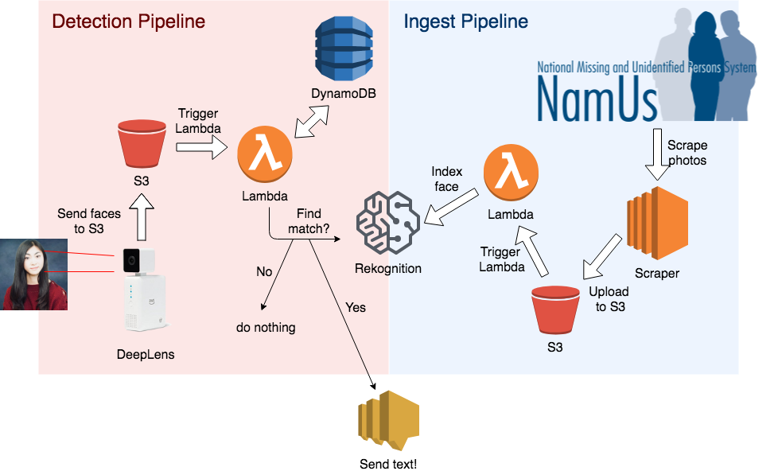

# IoT and Facial Recognition at Scale: Using Amazon’s DeepLens to search for matches from the US’s Missing Persons Database

Andrew Carlson, Vicki Foss, Gerard Kelly, Michelle Liu  
MIDS W251: Scaling Up! Really Big Data  
University of California, Berkeley  
August 2018

## About
Repo for W251 final project, for which we have created a cloud-based system whcih uses the [AWS DeepLens](https://aws.amazon.com/deeplens/) as an edge device to identify test subjects and pictures of people in the US's National Missing and Unidentified Persons System ([NamUs](https://www.namus.gov/About)) database, and which sends a text message alert with the person’s information upon finding a match.

 

## File Descriptions
- [IoT and Facial Recognition at Scale - Carlson, Foss, Kelly, Liu.pdf](https://github.com/acarl005/iot-missing-persons-detector/blob/master/IoT%20and%20Facial%20Recognition%20at%20Scale%20-%20Carlson%2C%20Foss%2C%20Kelly%2C%20Liu.pdf) - final paper

- [src/ingest/](https://github.com/acarl005/iot-missing-persons-detector/tree/master/src/ingest) - Directory containing scripts for ingesting and indexing NamUs data

- [src/deeplens_face_detection.py](https://github.com/acarl005/iot-missing-persons-detector/blob/master/src/deeplens_face_detection.py) - Lambda script for managing the DeepLens face detection

- [src/lambda_rekognition.py](https://github.com/acarl005/iot-missing-persons-detector/blob/master/src/lambda_rekognition.py) - Lambda script which checks for a match in the Amazon Rekognition index when the DeepLens detects a face and manages the alert process

- [rekog-demo.txt](https://github.com/acarl005/iot-missing-persons-detector/blob/master/rekog-demo.txt) - Amazon Rekognition demo

- [stats](https://github.com/acarl005/iot-missing-persons-detector/blob/master/stats) - Metadata on the missing person files initially scraped from NamUs
